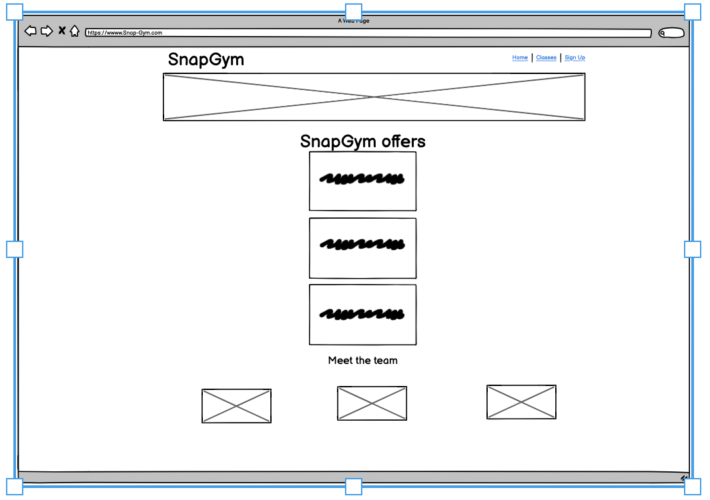
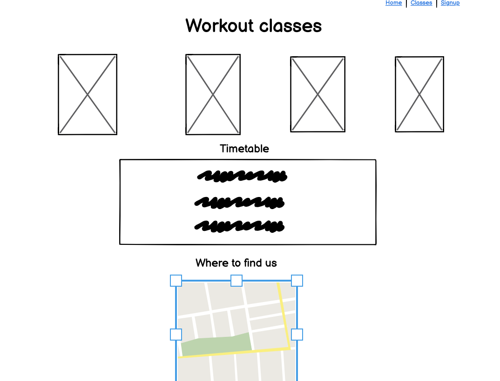
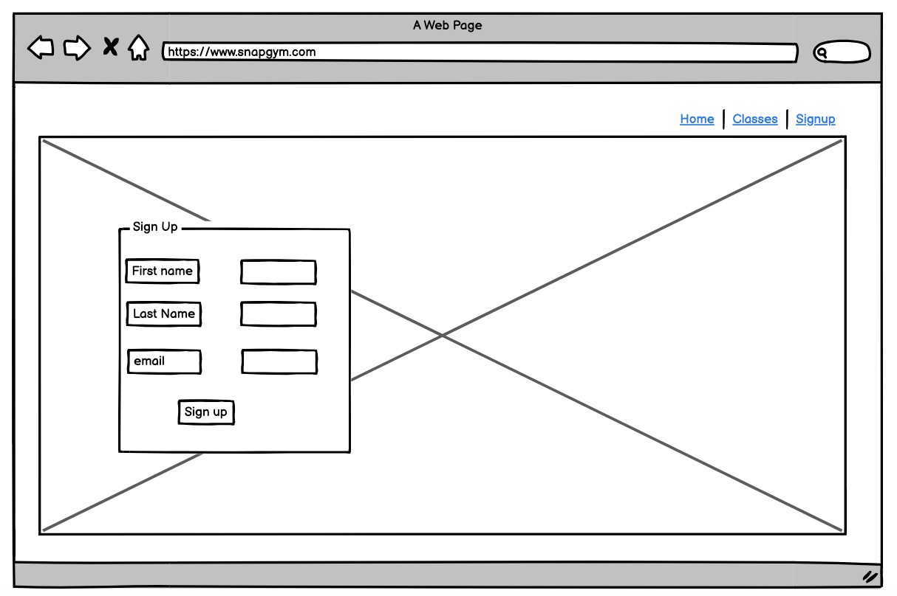
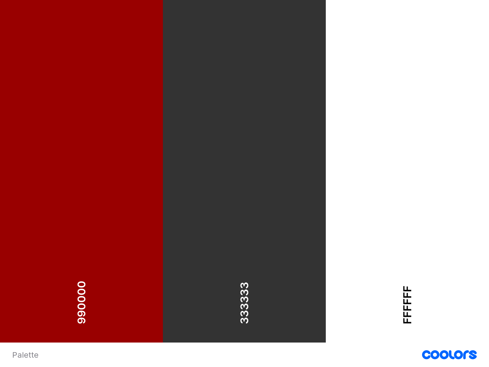
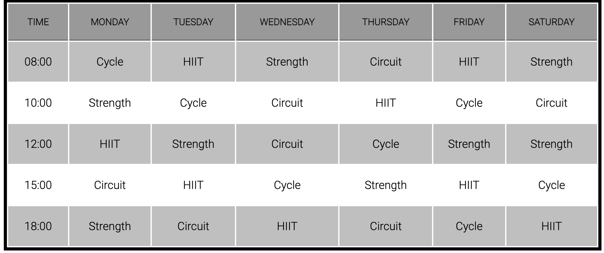
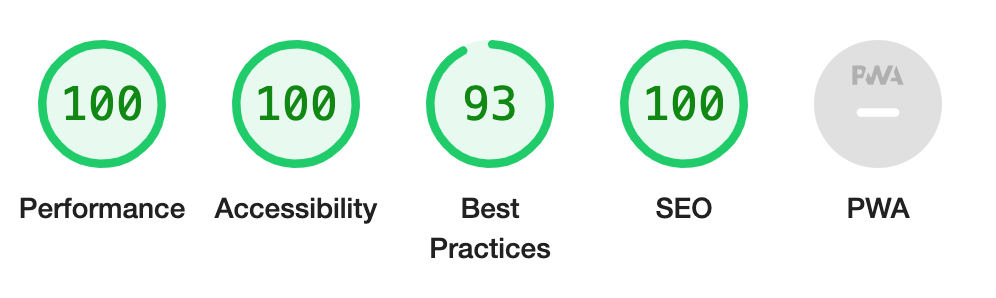
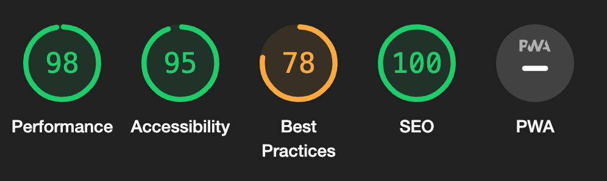
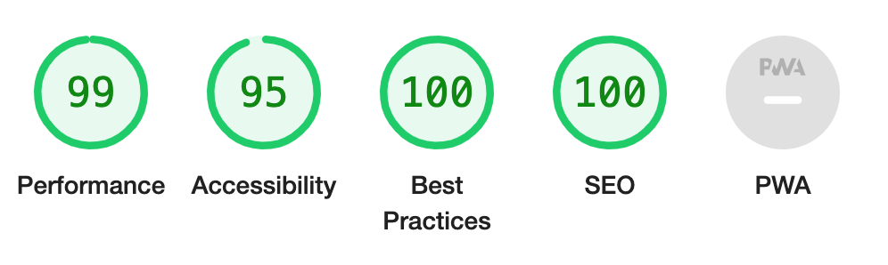
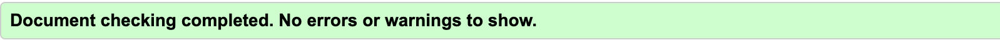

## SnapGym

SnapGym is a South Oxfordshire based gym. This website is targeted at people who are new to the fitness world, as well as people who relatively experienced. The website also provides information regarding the gym classes, class times and the sign up page. At SnapGym, we encourage everyone to start their fitness journey with us.

# User Experience 

## User Stories 

### First time visitor 

- as a first time visitor, I would like to understand the purpose of the website. I want to be able to navigate the different section of the site with ease and see what SnapGym has on offer
- I want to be able to get in contact with the gym and sign up

### Returning visitor

- I want to be find out more about the different classes
- I want to find out about classes time 
- To keep up with updates and information via their social media links
- To be able to access the gym site from different devices( phones, tablets and big screen desktop devices)

# Future Features

- Video tour of the gym
- Video introduction/short paragraph of the Personal trainers background
- 30 second videos of the classes offered at SnapGym
- Information in regards to price subscription

# Wireframes

# Design 

## Colors 

- I have used two main colors for my website. The main color was a deep red and charcoal grey for the writing with a white backgroud.

## Font 

- For the font, I decided to use a Russo one throughout the website, with sans-serif to fall back on. The Russo one is a very clean font which makes it very easy to read

# Navigation 

- SnapGym, which is the name of the website, is placed on the top left hand side of the page
- The 3 nagivation links (Home, Clases and SignUp page) are on the top right hand side of the page. 
- For easier navigation experiences, the nav links are highlighted 

# Header 

- For the landing page on the header section, I have included a carousel which consist of 5 pictures

## Home 

- The homepage, with the use of the carousel will enable the user to know that this is a gym site

## About SnapGym

- This section informs the user of what is on offer at SnapGym
- The aim of this section is to encourage the user to engage with the rest of the site and sign up
for classes 

## Meet the team 

- This section introduces the user to the 3 gym instuctors at SnapGym

## Footer 

- The footer section has links to SnapGym's main social media accounts. The links will open in a new tab for better user experience
- News & update will be posted on the social media accounts 
- The footer is designed in a way that the user can stay connected to SnapGym via Twitter, Instagram and Tiktok

## Workout Classes Page 

- This section of the website displays the 4 different classes SnapGym has on offer. Strength, Circuit, HIIT and Cycle workouts.
- Each workout boxes contain short explanation under the workout images, helps the user understands what the workouts are all about

## Timetable 

- This section provides the users with the workout timetables

## Where to find us

This section allows the user to see where the gym is located

## SignUp Page

- This section of the website features a main image with a sign up form within the image. Users will then be able to fill out their details on the form and pick the selcted classes and time they wish to attend.

# Testing

## Manual Testing

- I have performed a series of testing to make sure the site is fully responsive on all platforms
- The links in the navigation bar redirects the user to the designated section of the page
- The social media icons in the footer element directs the user to their designated social media link which will open up in a new tab

## Device Testing 

- I have tested my site on devices such as Iphone 14, Samsung galaxy tab A13, Hp desktop and all came back without issues

## Lighthouse report 

- Home Page

- Classes Page

- SignUp Page

# Bugs

 - The size of the form div on the Signup page was causing a horizontal scroll on smaller screen resolutions, I removed some of the css attributes such as "top: 15% & left: 15%" which fixed the issue
 - The size of my images were causing delays in the site loading up and therefore affecting the perfomance, I used a few image compressing websites to reduce the size of my images.

# Unresolved Bugs

 - Due to the nature of the required attribute on the select element in the SignUp form, the user has to select every workout classes and time schedule before being able to sign up for a class.

## Validator Testing

### HTML

There was no errors returned when passing the code from my 3 html files through the [W3C Markup Validator](https://validator.w3.org/)

- Home Page

- Classes Page

- Sign up

### CSS

Ther was no errors returned when passing the code through the [W3C CSS Validator](https://jigsaw.w3.org/css-validator/)

## Technology 

The technologies used are as follows:
- HTML
- CSS
- Github
- Gitpod
- Balsamiq

# Deployment

- The website was deployed via GitHub pages. The steps for the process of deployment are as follows:
    - In the GitHub repository, navigate to the settings tab
    - From the source section drop-down menu, select the Master Branch
    - Once the master branch has been selected, the page will will be refreshed with a detail ribbon display to 
      indicate that the website has been succesfully deployed

The link to the deployed site can be found here [SnapGym](https://kyrianu.github.io/Snap-Gym/)

# Credits

## Contents

- [Font Awesome](https://fontawesome.com/) The icons on the site where taking from font awesome
- [Google Fonts](https://fonts.google.com/) Where the fonts used on the website were taking from
- The map on the classes page was taken from [Google Maps](https://www.google.com/maps)

## Media

- The images used on the site were taken from [Pexels](https://www.pexels.com/) & [Shuttershock](https://www.shutterstock.com/search/gym)

## Code
- [W3schools](https://www.w3schools.com/howto/howto_css_column_cards.asp) where the code for the team section was taking from
- Header and navigation were taken from the Walkthrough project "Love Running"
- Image slider as the header was taken from 
- [W3C Markup Validator](https://validator.w3.org/) & [W3C CSS Validator](https://jigsaw.w3.org/css-validator/) were used for testing of my codes

